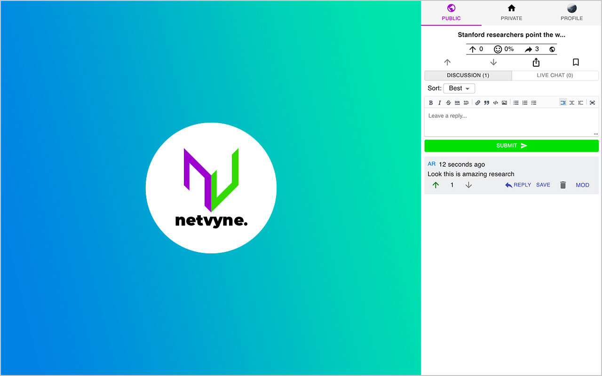

   

  

  Credible Comments, One Click Away

## Quick Links

- [Features](#features)
- [Contributing](#contributing)
- [Download](https://chrome.google.com/webstore/detail/netvyne-extension/hdmpoglhdchngeiefpiaiilfeicjjfap)

## Features

- Eliminate the need for account juggling as you visit different sites
- Join in conversation with fellow members of the Netvyne community
- Share pages with your friends, and start a discussion
- Include screenshots natively when sharing with friends
- Get fast, friendly support from the Netvyne team

## Contributing

If you encounter any issues with the extension, or if there's something you'd like to see added, please open an issue on Github!

Also, if you'd like to contribute code, you're more than welcome to do so! Please make an issue first so that we can discuss and be on the same page.

---
&copy; 2021-2022 Netvyne, Inc.
